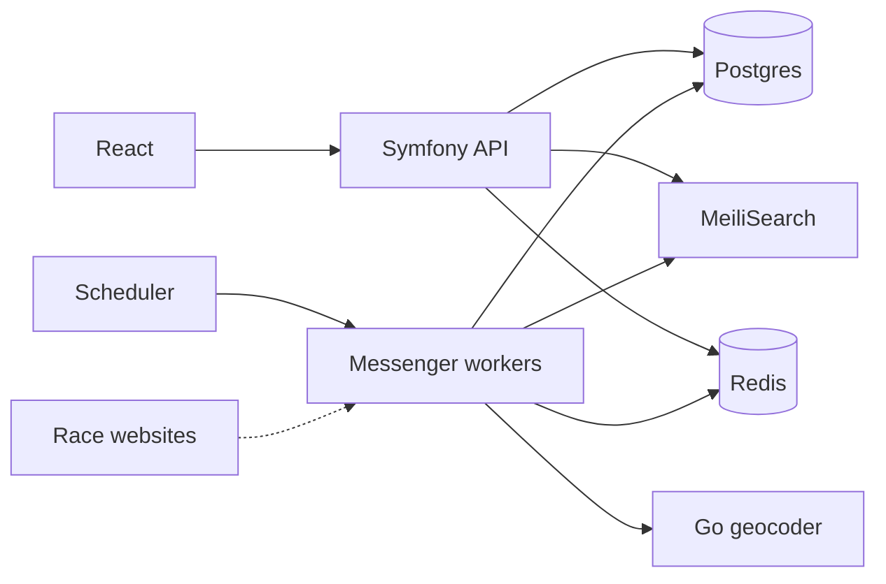
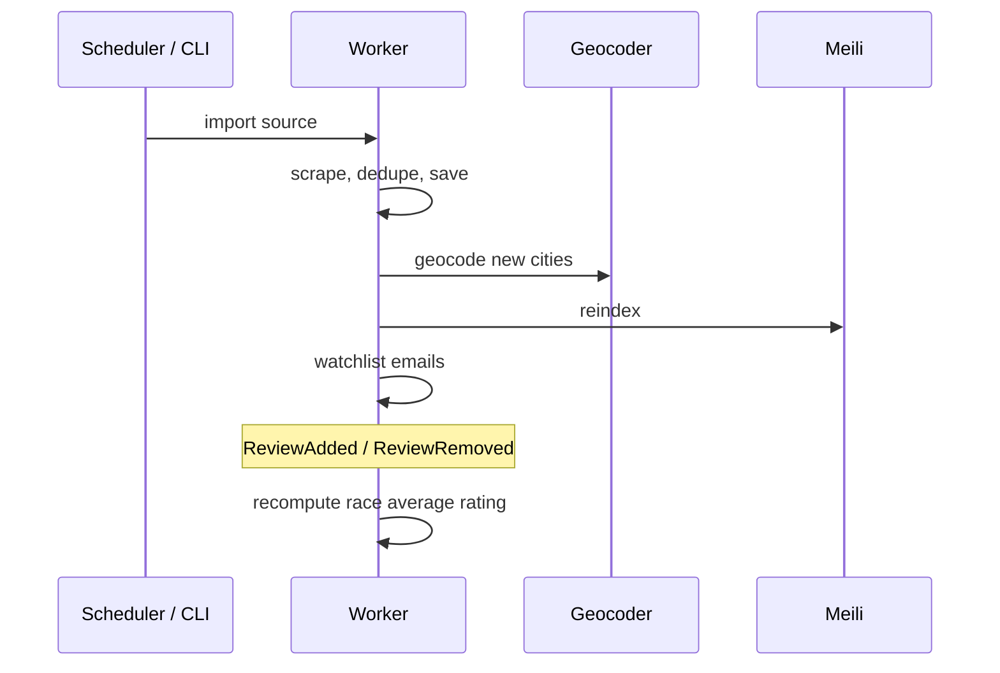

# RaceBoard

Catalogue of running races in Poland. It scrapes a couple of public calendars, cleans and merges the data, then exposes search + a small API. There’s a React app on top.

**Demo:** [raceboard.heaps.pl](https://raceboard.heaps.pl)

I built this as a learning / portfolio project — mainly Symfony backend, with a Go geocoder and a TypeScript frontend in the same repo.

## What it does

- Imports races from MaratonyPolskie.pl and running.life (dedupe + fill in missing voivodeship/distances)
- Runs imports on a schedule; heavy work goes through Messenger (Redis)
- Full-text search in MeiliSearch (filters, date range, map bbox); search results cached in Redis
- JWT accounts: watchlist, reviews (including delete of your own review), profile
- Go service for Nominatim geocoding (rate limit, cache, `/metrics`)
- React SPA: search, map, race page, watchlist, reviews

## Stack

PHP 8.4 / Symfony 7.4 · PostgreSQL 16 · Redis · MeiliSearch · API Platform 4 · Doctrine (XML mapping) · Messenger + Scheduler · Lexik JWT · React 19 / Vite / Tailwind / shadcn · Go geocoder · Docker · PHPStan 8 · PHPUnit · GitHub Actions

## How it’s structured

Symfony side is split into bounded contexts (`RaceCatalog`, `DataImport`, `Search`, `UserProfile`, `Review`, `Notification`, `Shared`). Each one is Domain → Application → Infrastructure. Domain doesn’t depend on Symfony or Doctrine attributes; mappings are XML, IDs are UUID value objects.

Contexts talk through domain events and small ports (e.g. Review asks “does this race exist?” via its own interface, not by importing RaceCatalog’s repository). Shared kernel holds cross-context IDs and `AuthenticatedUserInterface` so Security voters don’t pull in the User entity from another context.

Decisions worth reading: [`docs/adr/`](docs/adr/).



## Async path (short version)



Average rating is recomputed from current reviews in the DB (not incremented), so retries are safe. Search cache uses a tag-aware Redis pool; anything that writes to the Meili index drops the `search` tag.

## Layout

```
src/           Symfony contexts (see above)
geocoder/      Go Nominatim service
frontend/      React SPA
docs/adr/      ADRs
```

## Run locally

Needs Docker. Frontend needs Node 20+.

```bash
git clone https://github.com/mariuszsienkiewicz/raceboard.git
cd raceboard
docker compose up -d
docker compose exec php bin/console doctrine:migrations:migrate --no-interaction
docker compose exec php bin/console lexik:jwt:generate-keypair

docker compose exec php bin/console app:import maratony-polskie
docker compose exec php bin/console app:import running-life
docker compose exec php bin/console app:search:index

docker compose exec php bin/console messenger:consume async -vv
```

| | |
|---|---|
| API | http://localhost:8080 |
| Geocoder | http://localhost:8090 |
| Prometheus / Grafana (dev) | :9090 / :3000 |

```bash
cd frontend && npm install && npm run dev
# http://localhost:5173
```

## API (main bits)

Public: `GET /api/races`, `GET /api/races/{id}`, `GET /api/search`, `GET /api/search/map`, `GET /api/races/{id}/reviews`, `POST /api/register`, `POST /api/login`, `GET /sitemap.xml`.

Auth (Bearer JWT): `GET|PATCH /api/me`, watchlist under `/api/me/watchlist…`, `POST /api/races/{id}/reviews`, `DELETE /api/reviews/{reviewId}` (owner only — Symfony Voter).

## Import

Adapters implement `ImportAdapterInterface` and get picked up by a tagged iterator. Pipeline: scrape → normalize → duplicate check → create or enrich → persist → index → `RacesImported` (geocode / notify / reindex).

## Geocoder

Separate Go process: worker pool, 1 req/s toward Nominatim, in-memory cache, graceful shutdown. `POST /geocode`, `GET /health`, `GET /metrics`. Grafana is wired in the dev Compose file; prod skips it to save RAM on the VPS, metrics endpoint stays.

## Tests

```bash
docker compose exec php vendor/bin/phpunit
docker compose exec php vendor/bin/phpstan analyse
docker compose exec php vendor/bin/php-cs-fixer fix --dry-run --diff

cd geocoder && go test -race ./...
cd frontend && npm run lint && npm run build
```

## License

MIT
